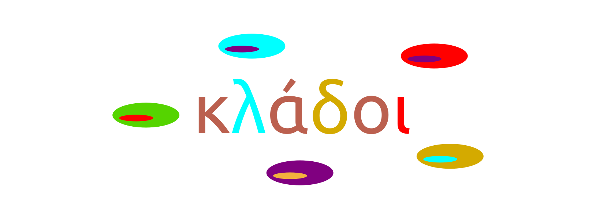

  
  <h1>κλάδοι</h1>
  
Standard Clades IOG

---

_A collection of common [Standard][std] clades used in IOG._

## Ethymology

From [Proto-Indo-European][pie] *kl̥h₂dos, from [*kelh₂-][klh] (“to break”). Cognates include [Latin][latin] [clādes][latin-clades], [Old Irish][old-irish] [caill][caill], [Old English][old-english] [holt][old-holt] ([English][english] [holt]), [German][german] [Holz][holz].

## Why?

- Have a central place where to define [Clades][clades] and use them everywhere.
- Not all Clades are suitable for upstreaming into [Standard][std].

## Usage

This is a prototype: consult usage with your Resident SRE.

A terse readme is favored &rarr; <a href="flake.nix"><code>flake.nix</code></a> is well commented!

[std]: https://github.com/divnix/std
[clades]: https://divnix.github.io/std/reference/clades.html
[pie]: https://en.wikipedia.org/wiki/Proto-Indo-European_language
[klh]: https://en.wiktionary.org/wiki/Reconstruction:Proto-Indo-European/kelh%E2%82%82-
[latin]: https://en.wikipedia.org/wiki/Latin
[latin-clades]: https://en.wiktionary.org/wiki/clades#Latin
[old-irish]: https://en.wikipedia.org/wiki/Old_Irish
[caill]: https://en.wiktionary.org/wiki/caill#Old_Irish
[old-english]: https://en.wikipedia.org/wiki/Old_English
[old-holt]: https://en.wiktionary.org/wiki/holt#Old_English
[english]: https://en.wikipedia.org/wiki/English_language
[holt]: https://en.wiktionary.org/wiki/holt#English
[german]: https://en.wikipedia.org/wiki/German_language
[holz]: https://en.wiktionary.org/wiki/Holz#German
